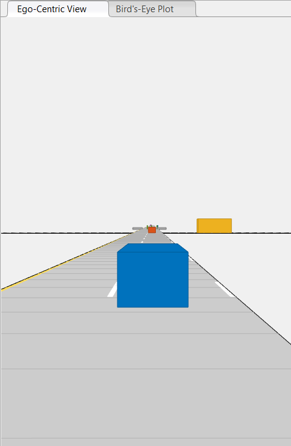
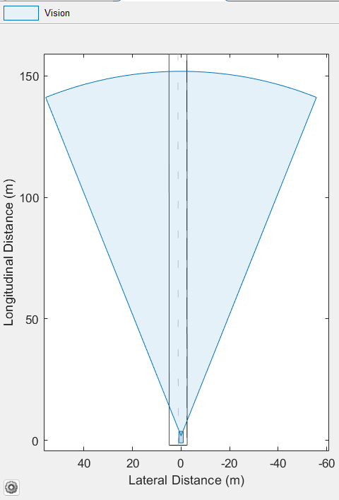

# Autonomous LKA & AEB System: From Physics to Functional Safety (ISO 26262)

This repository demonstrates the step-by-step development of an **Autonomous Lane Keeping Assist (LKA)** and **Autonomous Emergency Braking (AEB)** system using **Model-Based Development (MBD)** principles in MATLAB/Simulink. The project evolves from basic physical modeling to a safety-critical autonomous system compliant with automotive standards.

*Figure 1: Real-time ego-centric simulation of the autonomous vehicle.*

---

## 🛠 Technical Highlights
* **Methodology:** Full Model-Based Development (MBD) workflow.
* **Safety Standard:** Designed with **ISO 26262 Functional Safety** principles (Functional Safety Mastery certified).
* **Control Theory:** Implementation of PID regulation for lateral (steering) and longitudinal (acceleration/braking) control.
* **Perception:** Integrated vision sensor simulation for lane boundary tracking and object detection.

---

## 📈 Development Roadmap (V2 to V6)
The project is documented in stages to ensure traceability—a core requirement for ASIL-rated systems:

| Version | Focus | Key Features |
| :--- | :--- | :--- |
| **v2_Baseline** | Physics Foundation | Open-loop vehicle dynamics and environment setup. |
| **v3_Closed_Loop** | Feedback Systems | Implementation of closed-loop feedback for trajectory tracking. |
| **v4_Filtered** | Signal Integrity | Integration of signal processing filters for sensor data stabilization. |
| **v5_PID_Control** | Regulation | Fine-tuned PID controllers for smoother autonomous response. |
| **v6_Final_ADAS** | Functional Safety | **Final Release:** LKA & AEB integration with ISO 26262 safety logic. |

---

## 📡 Perception & Sensing
The perception layer manages a 150m longitudinal Field of View (FOV). Using the Bird's-Eye Plot, the system monitors target actors and lane boundaries to trigger safety-critical interventions.

*Figure 2: Sensor Field of View (FOV) and object detection visualization.*

---

## 🏗 System Architecture
To ensure deterministic communication and data integrity (essential for ISO 26262), the model utilizes structured **Bus Objects**. This ensures that ego-vehicle pose and sensor data are transmitted across the system without signal loss or dimension mismatch.

*Figure 3: Signal routing and Bus Management architecture in Simulink.*

---

## 💻 Core Algorithms
The primary logic is modularized into stand-alone MATLAB scripts to allow for code reviews and independent verification:
* **`otonomFren.m`**: Emergency braking logic based on distance-to-collision matrices.
* **`PoseCevirici.m`**: Transformation function for world-to-vehicle coordinate mapping.
* **`Surucu.m`**: Dynamic modeling of driver inputs and automated setpoints.

---

## 🚀 How to Run
1. Clone the repository.
2. Ensure you have the **Automated Driving Toolbox** and **Simulink** installed.
3. Open MATLAB and navigate to the `src/v6_Final_LKA_AEB/` folder.
4. Run `Otonom_Pist_V6_SeritTakip.mat` to load the scenario data.
5. Open and run `Otonom_Beyin_V6_Direksiyon.slx`.